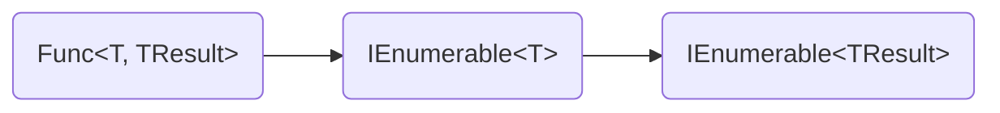
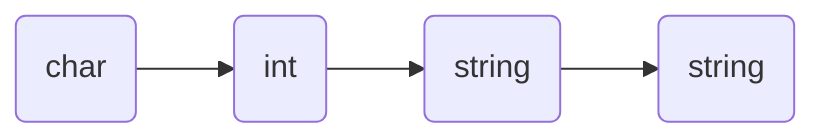
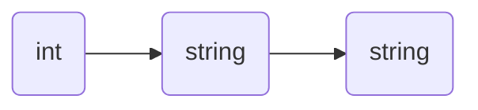

# Lodash/FP - A Primer

Throughout my professional career, functional programming has been the
mythical paradigm that developers talk about in both fear and awe. Quotes
like: "There's this cool new language, but its _functional_ so I guess I
won't learn it", and "Functional languages are so verbose. Why would I use
one instead of an OO language?" are commonplace. At the same time, when
looking at successful projects written in functional languages, developers
are in awe of the elegance, power, and conciseness of the style. A large
barrier to getting started with functional programming is the terminology. In
this post I'll cover the basics of functional programming and explain some of
the terms used in the [lodash/fp
documentation](https://github.com/lodash/lodash/wiki/FP-Guide) so it makes
more sense.

## Terminology - An Overview

First off we need to see some terms and definitions we'll use throughout the
article. Don't worry if you don't understand them now; we'll get into the
weeds later.

1. **First-Class Function**: functions can be assigned to variables
2. **Curry**: to partially execute a function
3. **Arity**: number of arguments are required before a function executes
4. **Iteratee**: an operation (function) to be performed on data
   5. **Variadic Iteratee**: an overloaded iteratee
4. **Immutability**: unable to be modified
6. **Composition**: practice of making a function by calling multiple
   iteratees in sequence

## First-Class Functions

In object-oriented languages, functions allow us to modify data inside an
object in a controlled manner. In order to invoke a function, you need an
instance of an object first and then you invoke the function on the object.
In functional languages, functions are what's called **first-class
functions**. Its as if _all_ functions were `static`. We don't need an
instance of an object to invoke a function. Additionally, functions are
treated just like variables. You can assign a function to a variable, pass it
to another function as an argument, and receive a new function as a return
result from another function.

This gives us a lot of potential to do things that are difficult in languages
that do not allow functions to be passed around or easily created. Imagine if
we wanted to write a function to sort an array by an arbitrary field. Our
only real option is to write a bunch of reflection and do string parsing.
With languages that allow functions to be passed around, we can simply
require a comparator function as a parameter and use that to compare elements
within our sort function.

JavaScript has **first-class functions**. This is a good thing. With
first-class functions we can begin writing code in a very functional way,
even without any of the other pieces! First-class functions allow us to
**compose** functions to produce new functions. This brings us to our next
definition:

## Currying (and Not the Food Kind)

Curry is a very strange technique, but has it's roots in mathematical
functions. With functional programming, we often have an existing function
that we want to extend or provide an explicit **iteratee** without requiring
the client code to provide it. This is where **currying** comes in. Simply
put, currying is the practice of providing some, but not all, of the
arguments to a function and producing a new function that remembers those
provided arguments. In order to really grasp currying, we're going to need
to think about functions differently. In languages like C# and Java
functions have a signature, generally something like:

```csharp
static IEnumerable<TResult> Map<T, TResult>(IEnumerable<T> sequence, Func<T, TResult> iteratee)
```

Its obvious what the return type is and what arguments we want to pass to the
function. The first step in turning this function into a functional
programming function is to rearrange the parameters. Functional functions
almost always have the **data last**. This is important, because when we're
**currying** we want to provide the partial implementation, not the data.

A functional version of this might look like:

```csharp
static IEnumerable<TResult> Map<T, TResult>(Func<T, TResult> iteratee, IEnumerable<T> sequence)
```

Simple! Now we're almost ready for currying. The last thing we want to do is
think about the arguments and what we're actually producing. F# has a really
novel syntax for describing function parameters and return types that helps
think about how you can curry a function.



Looking at this sequence diagram is a little confusing at first until you
realize the power of what it's describing. Think of parenthesis in math. You
can draw a set of parentheses around any sequence of operators, and that gets
executed before the rest of the function. If you only evaluate the stuff
inside the parentheses, you're actually left with another function!
Functional programming is the same. We can provide _some_ arguments to a
function and be left with another function. If we provide the `Func<T,
TResult>`, we're left with a function that takes an `IEnumerable<T>` and
returns an `IEnumerable<TResult>`. If we pass both a `Func<T, TResult>` _and_
an `IEnumerable<T>`, what's left? An `IEnumerable<TResult>`! Which means
we've executed the function and are left with data! Currying provides us
with a flexible and descriptive way to chain functions without resorting to
invoking a function, store it in a variable, pass that to the next function,
store _that_ result in another variable, etc, or; even worse, put all the
method calls one inside the other and then attempt to count how many
parentheses are at the end and which arguments belong to which function.

There is only one teensy problem with currying. Let's inspect the Lodash
function `padStart`. `padStart`'s signature looks like this:

```csharp
string PadStart(string str, int numCharsToPad, char padWith = ' ')
```

If we want to functionalize that function:

```csharp
string PadStart(int numCharsToPad, char padWith = ' ', string str)
```

That's not good (or allowed!). How would we represent an _optional_ parameter
before the required parameter of the **data**? The short answer is, we don't.
The longer answer is we employ **arity**.

## Arity

Arity is simply the number of arguments we must pass to a function before it
is able to be executed fully and return data instead of another function.
Function has an arity of three? Pass three arguments and you'll execute the
function. The `PadStart` function in the previous section with the optional
parameter only really requires two arguments to be passed in order to execute
(`str` and `numCharsToPad`), so we would say that it has an **arity** of two.
But what about that optional parameter? **Arity** is not fluid. A function
can only have one **arity** value. So if we want optional parameters, we need
another function that has a different **arity**. Something like:

```csharp
string PadStartWithChars(char padWith, int numCharsToPad, string str)
```



Now we're getting somewhere! `PadStartWithChars` has an arity of _three_. We
can actually **curry** `PadStartWithChars` to _create_ the implementation of
`PadStart`!

```csharp
PadStart = Curry(PadStartWithChars)(' ');
// string PadStart(int numCharsToPad, string data);
```


We could **curry** `PadStart` then again to make `PadStart8`, or something
like that. The general approach to designing overloaded functions when
functional programming is to design the _most complicated_ function you can
with all the optional parameters, and then **curry** it to produce the
simpler versions of the function.

## Iteratees

Iteratees are simple. These are functions! Most Lodash/fp functions take some
form of **iteratee** to provide business logic to the generic functions. Some
examples:
* `map` takes an iteratee that accepts a value and returns the mapped value.
  * Map an array of numbers to it's squared values: `a => a * 2`
* `filter` takes an iteratee that accepts a value and returns the boolean
  describing whether the value should be kept
  * Find all even numbers: `a => a % 2 === 0`
* `sum` takes an iteratee that accepts a value and produces the amount to be
  summed from that value
  * Add all the lengths of an array of strings: `str => str.length`

#### Variadic Iteratee

You'll hear this term occasionally. These are bad. These are iteratee's that
have optional parameters which, as we know, are the bane of functional
programmers everywhere. To get around these, all of the Lodash/fp functions
are **capped**. This means they don't pass all the optional arguments that
the traditional Lodash functions pass to their iteratees. The Lodash/fp docs
explains this very well with the `parseInt` example. Recall that `parseInt`
in JavaScript takes _two_ arguments: `stringValue` and `radix`. The `map`
function in traditional Lodash has an iteratee with the signature:

```csharp
TResult iteratee<T, TResult>(T value, int key, T[] ray);
```

If you call traditional Lodash `map` and pass `parseInt` in as the iteratee,
you're gonna have a bad time. The `index` of the element in the data array
is going to be passed in as the `radix` to the `parseInt` function!

Lodash/fp decided to ignore this nonsense and only pass in the required
parameters. Lodash/fp's `map` function takes an iteratee that only accepts
one argument: `value`.

## Immutability

Immutability is sounds simple: Don't. Modify. Data. Repeat this mantra to
yourself while you're programming. Turn on the eslint rule to switch let to
const. turn on the eslint rule about modifying arguments. Turn on everything
to help remind you that if you modify data, you're going to have a bad time.

As JavaScript projects get bigger and bigger, data gets passed around through
functions to places it never expected to go. You pass some data into a
library that needs lowercasing and your strings get lowercased, even though
your business domain operates in camelCase. You pass an array into a fancy
math library you found online and your array is now garbled and has weird
math-y symbols inserted everywhere you neither know how to read nor where
they came from. Your React state gets passed to a function makes an ajax call
and manipulates the data and now your state is corrupt.

Immutability helps fix these situations of terror. When we write custom code,
**Don't. Modify. Data.** If you need to change the values in an array, *Make a
*new array**. If you need to capitalize one of the values in the
object that gets passed in, **make a new object**. Strive to have **ZERO**
side-effects in your methods. This will make your life significantly easier
when learning functional programming.

## Composition

Now that we know lots of terms, we can talk about **composition**. Rather
than calling a function, storing the result in a constant, passing that in to
the next function, storing that result in another constant, etc, we can take
advantage of **composition**. Lodash/fp provides a function named `flow` to
help with this. Let's assume we have an array of students. We want to find
all the students in the third grade, take their highest test score, and
average them all together to get a class average. Flow makes this easy:

```javascript
const thirdGradeAverage = flow(
  filter({ grade: 3 }),
  map(max(map('testScores'))),
  average,
)(allStudents)
```

Let's break this down:
* `filter({ grade: 3 })` is going to take in `allStudents` and produce a new
  array of all students in the third grade
* `map(max(map('testScores')))`