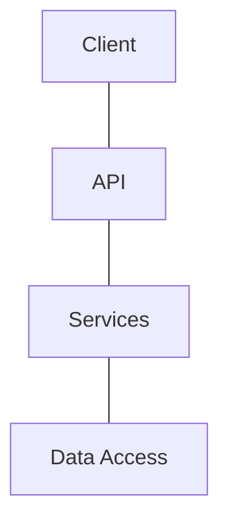

# Redux Reducers - Horizontal vs Vertical

When using Redux, one of the hardest decisions we will have to make is
whether to organize the reducers by data relevance or by area of site. Both
ways might be right in certain situations, and often however one decides to
set up their first Redux project is the way they will set up future projects,
even if the alternative reducer configuration would work better.

## Reducer Direction

I recently had difficulty describing the different reducer configurations to
a colleague until I explained them in terms of the product stack. Imagine
you have a standard N-Tier architecture stack:

