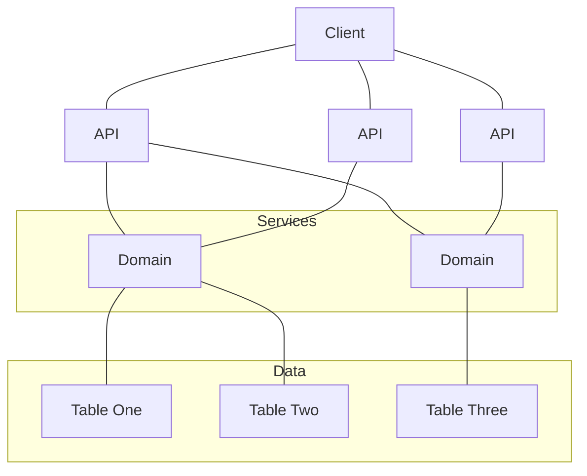

# Redux Reducers - Horizontal vs Vertical

When using Redux, one of the hardest decisions we will have to make is
whether to organize the reducers by data relevance or by area of site. Both
ways might be right in certain situations, and often however one decides to
set up their first Redux project is the way they will set up future projects,
even if the alternative reducer configuration would work better.

## TL;DR

1. Redux state isn't a relational database, and shouldn't be organized as
   such
2. **Reducers**: Decouple from your business logic so that others can
   interface without requiring regression testing of your usage of them
3. **Actions**: Tightly couple your business logic so that the code can be
   reused across multiple views without duplicating code

## Reducer Direction

I recently had difficulty describing the different reducer configurations to
a colleague until I explained them in terms of the product stack. Imagine you
have a standard N-Tier architecture stack:



Generally you have APIs organized by actions your client needs to take, and
services organized by business domain. One API can call into multiple domains
to get the data it needs. Domains own their own data, and do not share data
with other domains. We can design our reducers either to be like **APIs** or
like **Domains**. Reducers that map to APIs are what I call **Vertical
Reducers** because they have all the data necessary for one specific view,
and nothing more. When you need to render the view, you know all the data
exists within the single slice of the Redux state specified for that reducer.
Reducers that map to Domains are what I call **Horizontal Reducers** because
they contain all the logic for a specific domain concept. All the logic for
modifying that domain resides within that specific slice.

## Horizontal Reducers

The most common way I've seen reducers organized is horizontally. Horizontal
is an appealing organization scheme because its how most developers think of
the app. When we want to add a new action, we go create the action with the
payload, then go to the corresponding reducer and add the action handler. It
keeps everything in one place allowing new developers to discover everything
that uses a given domain. We know where to get data for a view because we
know our domain. For instance in React, we just have to connect to our state
and transform the data from the domain's structure into whatever the view
needs in `mapStateToProps`. Modifying actions is convenient because it is
easy to find the matching reducer, and there is only one place to go update.

Let's take time-honored example of the Todo List. We might have a setup like
the following:

State:
```js
{
  todos: [{
    id: 1,
    name: 'Take out the trash',
    dateCreated: '2019-03-04T22:52:52.722Z',
    completed: false,
  }, {
    id: 2,
    name: 'Do the dishes',
    dateCreated: '2019-03-04T22:52:52.722Z',
    completed: false,
  }, {
    id: 3,
    name: 'Walk Havoc',
    dateCreated: '2019-03-04T22:52:52.722Z',
    completed: false,
  }],
}
```

Actions:
```js
CREATE_TODO: {
  name,
  dateDue,
}
START_EDIT_TODO: {
  id,
}
EDIT_TODO: {
  id,
  name,
  dateDue,
}
MARK_TODO_COMPLETED: {
  id,
}
```

Reducers:
```js
todos: {
  CREATE_TODO: ...,
  EDIT_TODO: ...,
  START_EDIT_TODO: ...,
  MARK_TODO_COMPLETED: ...,
}
```

Despite being easy, there are a couple significant problems with this
approach. The highest risk is the regression risk of modifying the domain.
Often we'll have a new feature request that requires changing the structure
of some data in our Redux state. For example we read a blog post about the
performance benefits of storing keyed objects instead of arrays in Redux and
would like to do so. We'll change the structure, go modify all of our
`mapStateToProps` (or equivalent), and we're off to the races, right?

Wrong. Because there are things out of our control. The team across the
building has found our project useful and has added features to another part
of the website by reading data out of our Redux state. We now have to
communicate any data shape changes with another team, and are blocked
deploying any changes until they have updated their app to work with the new
shape. Another team needs our data, but needs to add a business rule to the
reducer, so now there is an `if` statement switching between two flows. Then
another team does it again and now its not a reducer, its a switch statement
that changes the data in the state depending on the app its being used by.
And then someone persists the state, causing another app's data to load into
your app.

Yikes.

Another sneaky problem surrounds this structure. We have these domain
specific slices in our reducer we have to interface with via actions. We
begin by trying to build actions that are tied to the domain, (`createTodo`,
`markTodoCompleted`, and `editTodo`), but the UI isn't organized by shape of
the domain, and often has extra state that must be stored that isn't part of
the domain. Lets assume a very reasonable request like being able to edit
todos in a modal, but refreshing the page should not dismiss the modal.
Naturally Redux is a great place to persist this. We have two options:

1. Write a new reducer slice to house the UI data which lives next to the
real domain slices
```js
{
  todos: [ ... ],
  currentTodo: 3
}
```
2. Update our domain slice to have UI specific data.
```js
{
  todos: [
    ...,
    {
      id: 2,
      name: 'Do the dishes',
      dateCreated: '2019-03-04T22:52:52.722Z',
      completed: false,
      selected: true,
    },
    ...
  ]
}
```

Option 1 is preferable, but Option 2 is how this situation tends to pan out
as it is easier and lazier. Keeping UI logic out of the domain takes
diligence and care when working with a team and is very easy to overlook
during code reviews until it is too late.

## Vertical Reducers

What if instead we organized our reducers as if they were APIs? Instead of
coupling to our domain logic, the reducers will provide all the data a
specific view needs in whatever format it needs it in, _without affecting any
other view_.

> If another team wants to start interfacing with our code, they just start listening to our actions and, more importantly, **they don't modify our reducers**

We alleviate the many of the problems of horizontal reducers by decoupling
our app and deployment from other apps and organizing data by UI usage
instead of by domain. We know exactly what our view needs, and no one else
should have to worry about what we're doing or how we're storing our data. If
we need to put UI data in Redux for some reason, we can spin up a new action
and edit our little slice of the reducer rather than trying to squeeze it
into an existing domain.

Instead of the horizontal style, our vertical state might look like:

State:
```js
{
  todoList: {
    1: {
      name: 'Take out the trash',
      dateCreated: '2019-03-04T22:52:52.722Z',
      completed: false,
      dateDue: '2019-03-11T12:00:00.000Z',
    },
    2: {
      name: 'Do the dishes',
      dateCreated: '2019-03-04T22:52:52.722Z',
      completed: false,
      dateDue: '2019-03-10T00:00:00.000Z',
    },
    3: {
      name: 'Walk Havoc',
      dateCreated: '2019-03-04T22:52:52.722Z',
      completed: false,
      dateDue: '2019-03-10T14:00:00.000Z',
    },
    byDateDue: [2, 3, 1],
    byDateCreated: [1, 2, 3],
  },
  editTodo: {
    id: 3,
    placeholder: 'Walk Havoc',
    newName: 'Walk Havoc and Lilah',
  },
  createTodo: {
    name: 'blah',
    errors: ['Name must be more than 10 characters'],
  }
}
```

Actions:
```js
CREATE_TODO: {
  name,
  dateDue,
}
START_EDIT_TODO: {
  id,
}
EDIT_TODO: {
  id,
  name,
  dateDue,
}
MARK_TODO_COMPLETED: {
  id,
}
```

Reducers:
```js
todoList: {
  CREATE_TODO: ...,
  EDIT_TODO: ...,
  MARK_TODO_COMPLETED: ...,
},
editTodo: {
  START_EDIT_TODO: ...,
},
createTodo: {
  START_CREATE_TODO: ...,
}
```

Wow. Without even talking about implementation code we can see the structure
of the different views and what data they require. Additionally, the views
are decoupled from each other entirely. We can reuse the Edit modal somewhere
else and know that when we're done and fire the `EDIT_TODO` action,
everything everywhere else will work as _they_ expect to work.

## Conclusions

In the effort to turn out more features quickly and reduce code duplication,
we often find ourselves coupling our views to the way our data is structured
in the database. This can cause a multitude of problems such as unintuitive
UX choices, increased risk of unrelated regression errors, and code smells.
Redux is a very powerful tool, and if we use powerful tools incorrectly, we
get very powerful (and costly!) mistakes. Redux isn't something to be afraid
of, but needs some thought before rushing in to using it or our code can end
up in a bad place.

In your next project try out vertically organized reducers. You'll be
surprised at how natural it feels and how easily you can make changes to
existing views. The stress-free modification and creation of new views will
make your next project enjoyable to work in and quicker for new developers to
get on-boarded as they won't need to understand the entire app to begin
contributing useful and impactful code.
